# Banking-Grade Exploratory Data Analysis

## Scope and Important Interpretation

The EDA covers 2,260,701 accepted loans originated from 2007 Q2 to 2018 Q4. Default is reported as `Charged Off` or `Default` divided by all originations. This is an observed, unconditional portfolio measure and is **not** a mature-cohort PD or a production default-rate estimate; the sharp fall in late-2018 default rates is a vintage-maturity effect.

## Portfolio Overview

| Metric | Result |
| --- | ---: |
| Total loans | 2,260,701 |
| Total funded amount | $34.00bn |
| Total loan amount | $34.02bn |
| Average loan amount | $15,046.93 |
| Average interest rate | 13.09% |
| Average annual income | $77,992 |
| Average DTI | 18.82 |
| Average FICO midpoint | 700.6 |
| Average revolving utilisation | 50.34% |

**Observation:** the portfolio is a large, broadly prime consumer-installment book with a material average coupon and moderate mean DTI.  
**Business interpretation:** $34bn of originations makes small segment-level shifts financially material.  
**Risk implication:** averages conceal tails and vintage effects; exposure-weighted and cohort views are required.  
**Recommendation:** use concentration and outcome monitoring alongside averages in ongoing portfolio reporting.

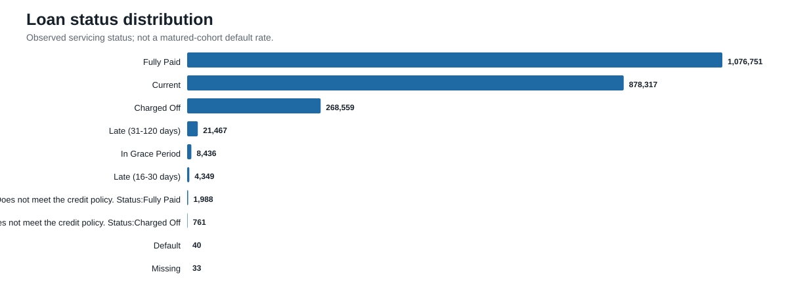

**Observation:** Fully Paid (1.08m) and Current (0.88m) dominate; 268,559 loans are Charged Off.  
**Risk implication:** current accounts include unresolved future outcomes.  
**Recommendation:** impose a performance-window maturity rule before using `loan_status` as a model target.

## Risk Segmentation

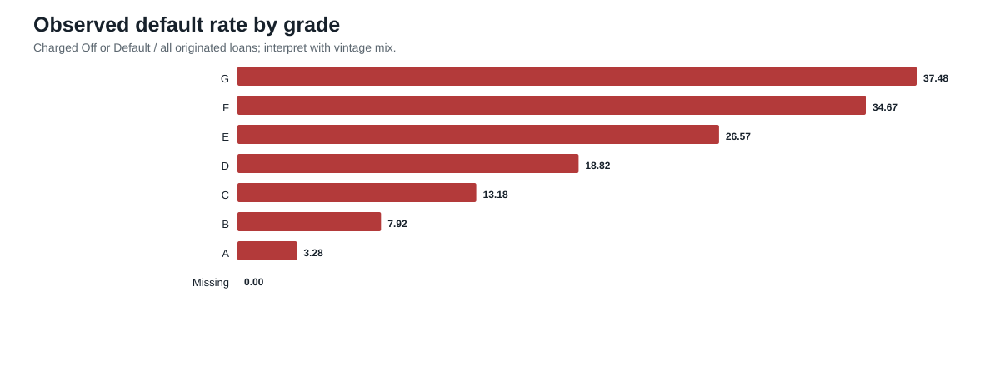

**Observation:** observed default rates rise monotonically from A (3.28%) to G (37.48%).  
**Business interpretation:** LendingClub’s grade hierarchy is strongly risk-ranked and price/risk aligned.  
**Risk implication:** grade is a powerful portfolio stratifier but may embed lender policy or model output.  
**Recommendation:** use grade for benchmarking and monitoring; challenge its eligibility as a development feature.

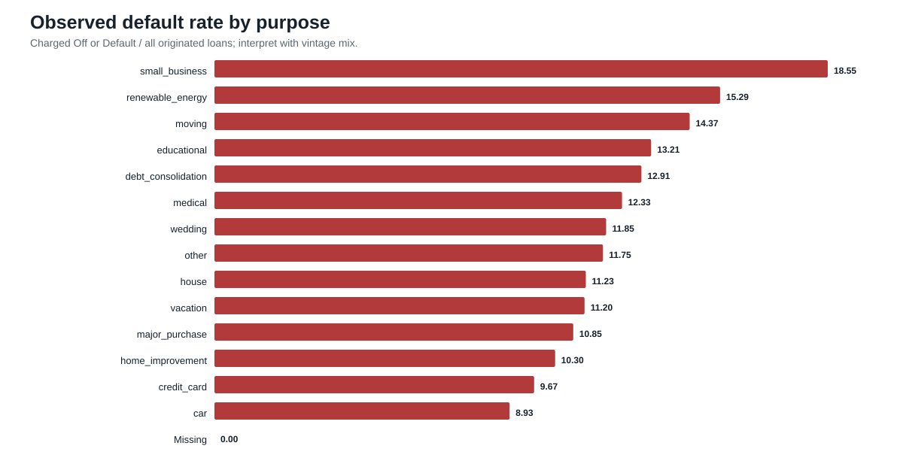

**Observation:** debt consolidation represents 1.28m loans and a 12.92% observed default rate; small business is materially higher at 18.55%.  
**Business interpretation:** purpose mixes borrower need, affordability, and self-selection.  
**Risk implication:** large debt-consolidation exposure means modest deterioration can dominate portfolio loss.  
**Recommendation:** monitor purpose-level mix and performance by vintage, not only point-in-time rates.

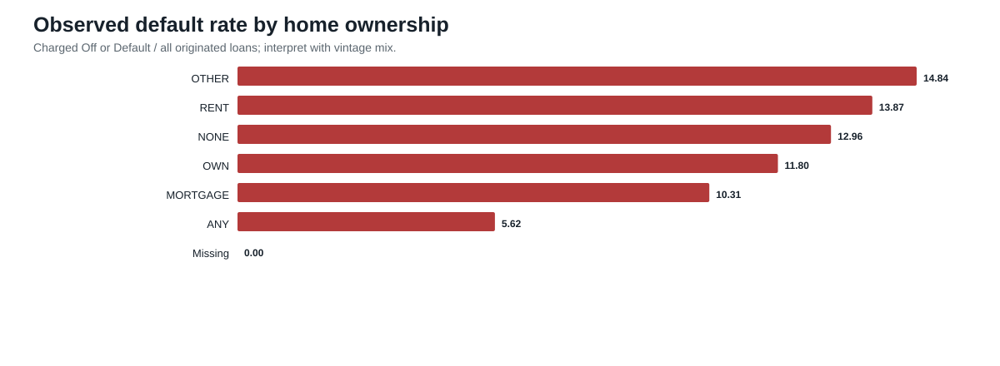

**Observation:** renters show 13.87% observed default compared with 10.31% for mortgage borrowers.  
**Business interpretation:** housing tenure likely proxies for financial stability, income, and age; it is not causal evidence.  
**Risk implication:** tenure can identify risk concentration but must receive fairness and policy review.  
**Recommendation:** assess it jointly with affordability and geography before any use in policy.

**Observation:** Verified and Source Verified loans have higher observed default than Not Verified.  
**Business interpretation:** verification status is likely a process/risk-selection marker rather than a protective treatment.  
**Risk implication:** a naïve interpretation would be misleading and could create model bias.  
**Recommendation:** investigate underwriting rules and applicant mix before relying on this field.

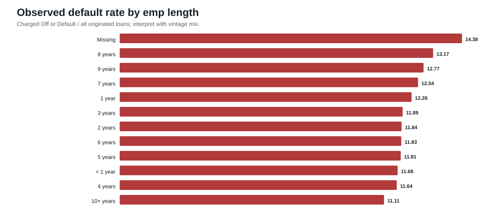

**Observation:** missing employment length has a 14.38% observed default rate and lower average income than established employment groups.  
**Risk implication:** missingness may be informative or process-driven.  
**Recommendation:** document source-process causes before deciding whether missingness is usable in a controlled model.

## Time-Based Analysis

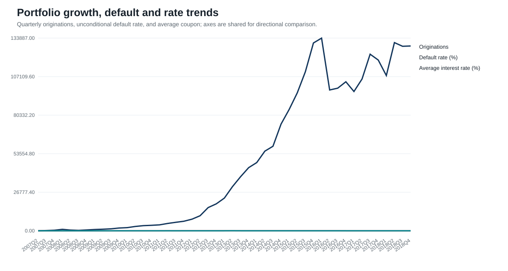

**Observation:** originations expand sharply after 2013, while the unconditional observed default rate falls mechanically for recent vintages.  
**Business interpretation:** short observed windows create right censoring.  
**Risk implication:** comparing 2018 to earlier vintages without maturity controls understates risk.  
**Recommendation:** establish vintage cohorts and fixed 12-month/24-month performance windows for all risk reporting.

## Concentration Risk

California is the largest state exposure (314,533 loans), followed by New York and Texas at approximately 186,000 each. Grade B and C together account for 58.1% of loans; debt consolidation accounts for 56.5%. These concentrations are not intrinsically adverse, but they make portfolio performance sensitive to changes in a small number of segments.

**Recommendation:** establish limits and early-warning thresholds by state, grade, purpose, and vintage; assess geographic concentration against external macroeconomic stress where permitted.

## Correlation Analysis

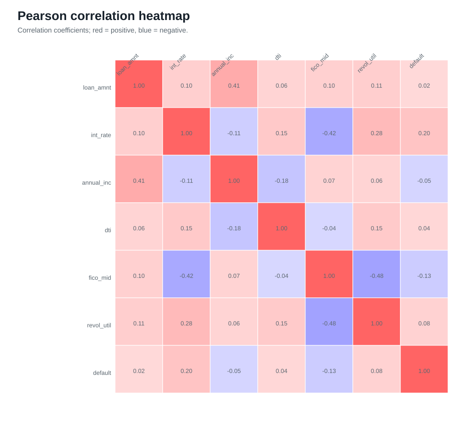

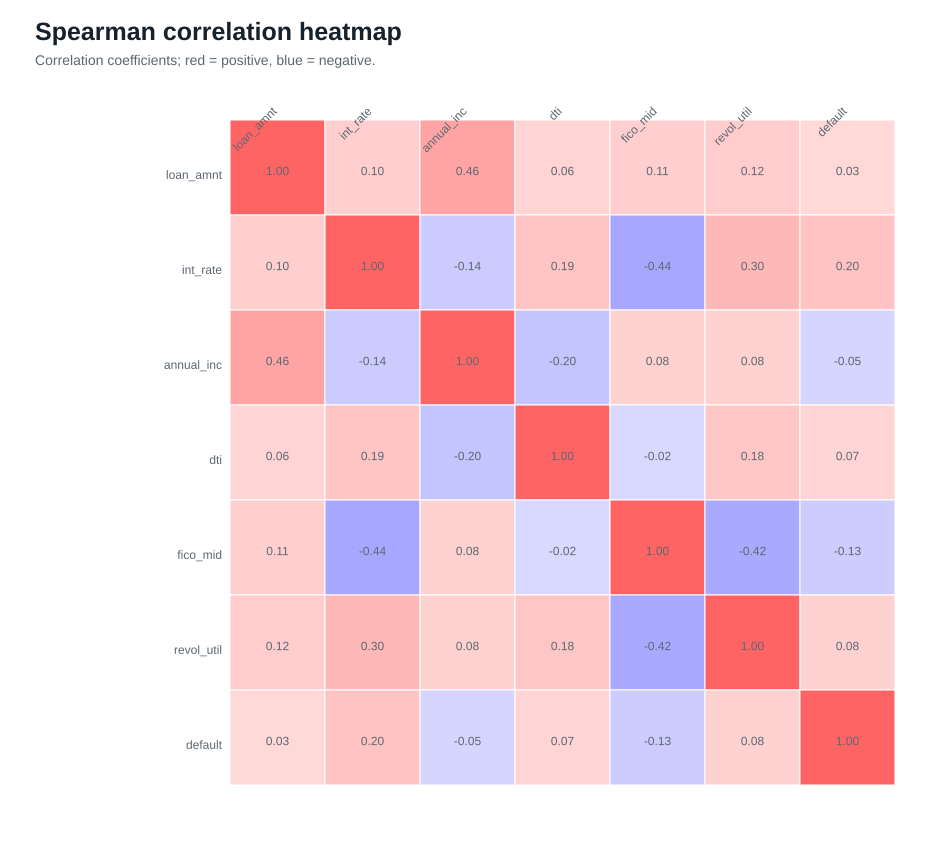

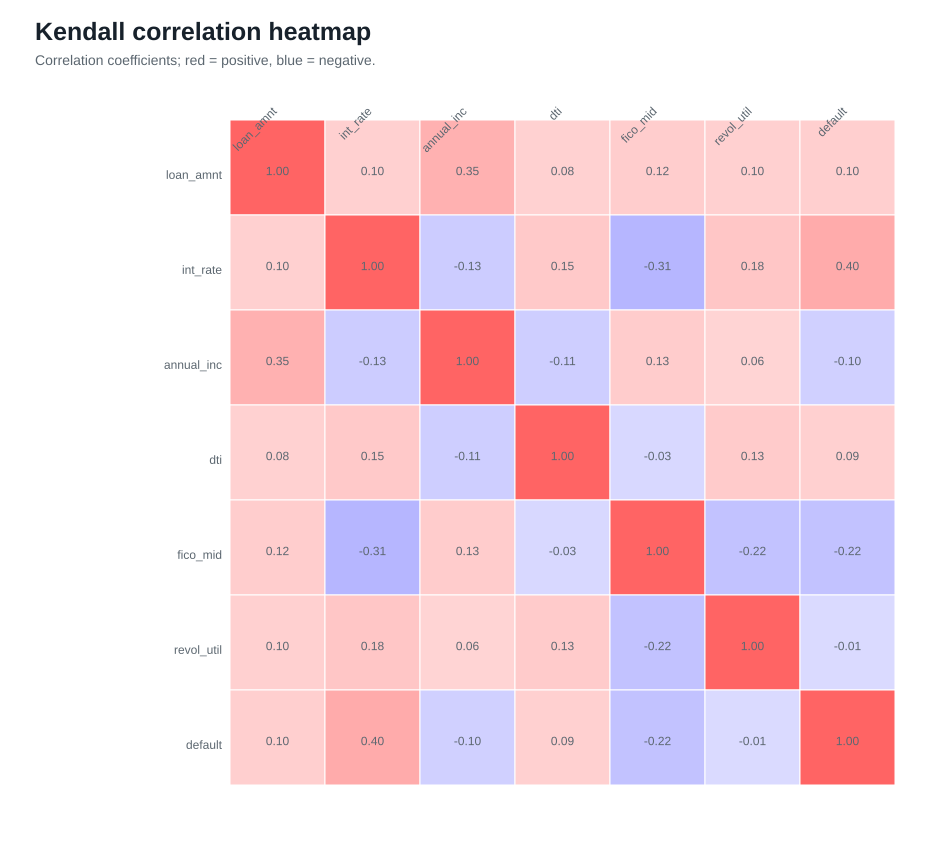

**Observation:** the three metrics provide complementary linear and rank-based views.  
**Risk implication:** correlation does not establish predictive usefulness, causality, or suitability at application time.  
**Recommendation:** retain correlated variables during EDA; later modelling governance should assess stability, interpretation, and redundancy without deleting fields at this stage.

## Distribution Analysis

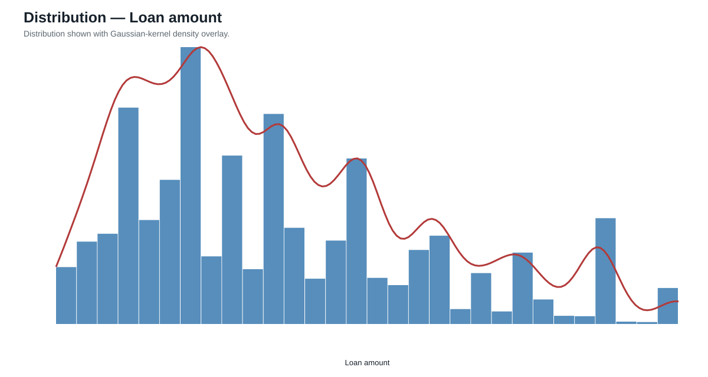

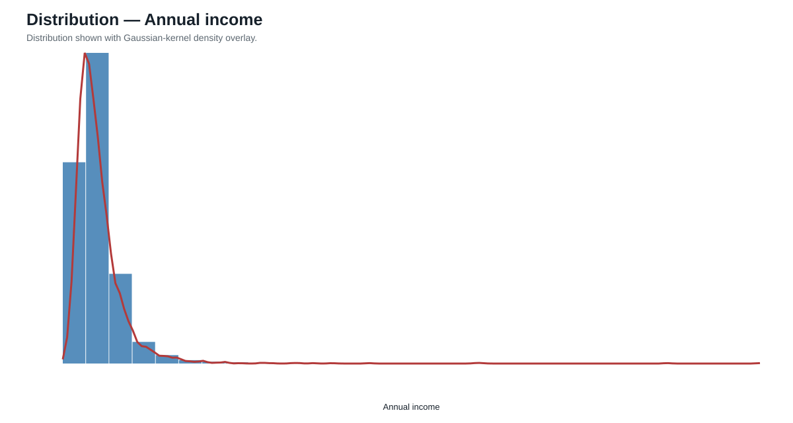

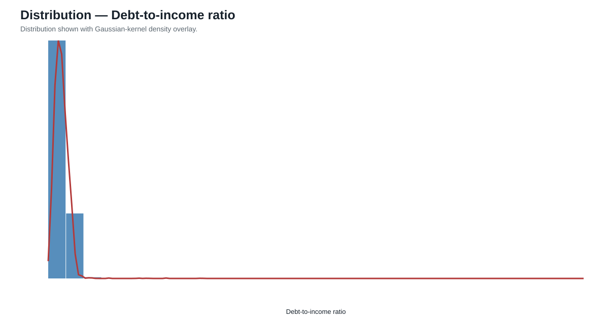

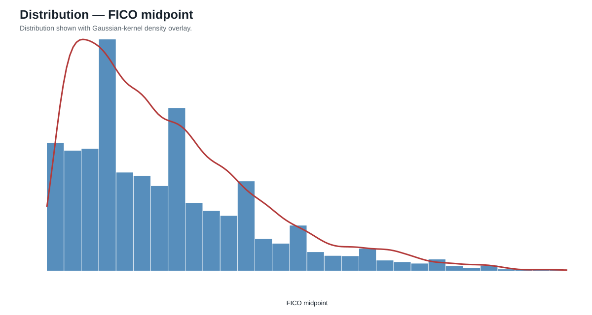

**Observation:** income and revolving balances are right-tailed; loan amount and FICO show operational bands; DTI and utilisation exhibit tail risk.  
**Business interpretation:** means are sensitive to extreme incomes and balances.  
**Risk implication:** outliers may be genuine high-exposure borrowers or data issues and require separate validation.  
**Recommendation:** retain raw distributions and perform controlled domain/outlier checks in the next quality-control cycle.

## Limitations

The supplied source does not include rejected applications or a data dictionary. No industry field was observed in the EDA view. No raw values were modified, no columns were removed, no predictive model was built, and no feature engineering was performed.
